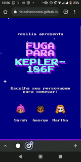

# FugaParaKepler-186F
A simple quiz game

  
  

**A very simple 16-bit game made with Vanilla JavaScript, CSS and HTML. It was a first "term paper" project of @resilia-br bootcamp. In this project we use a prompt to catch the player's answer through a function.**

## UPDATE 1/17/2022
This project has been updated and prompts windows has been removed.

## Challenge rules:
- Each level must have a prompt window with at least 2 possibilities
- Use Vanilla JavaScript and DOM to manipulate the page
- Use pure CSS and HTML only
- Use a "while" and "function" in this project
- Must have at least 3 characters
- Must have a game over page
- Each level must have a HTML file

Projeto final do módulo 1 da @resilia-br. O objetivo era criar um jogo de perguntas e respostas em JavaScript com, no mínimo, 3 personagens, sendo o uso do prompt obrigatório. 
